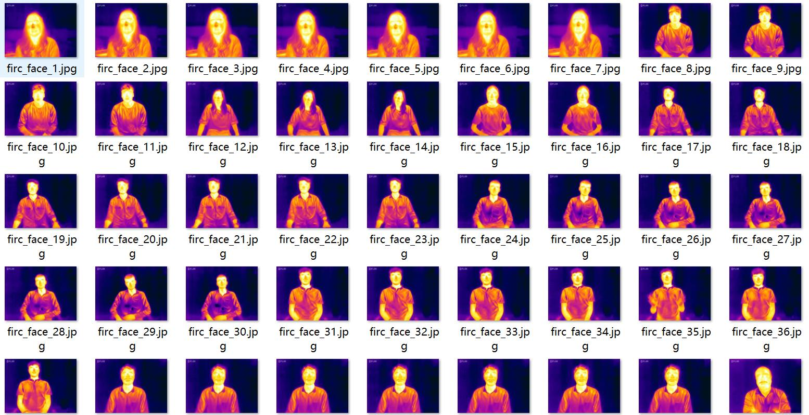
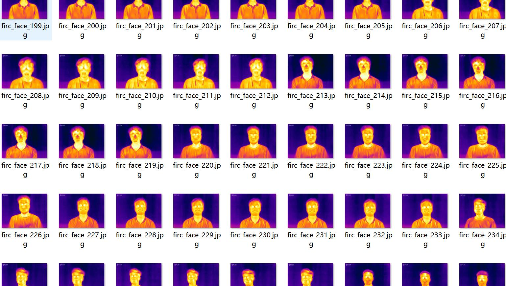
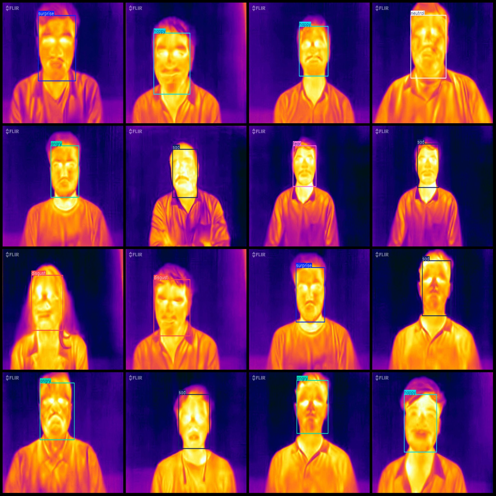
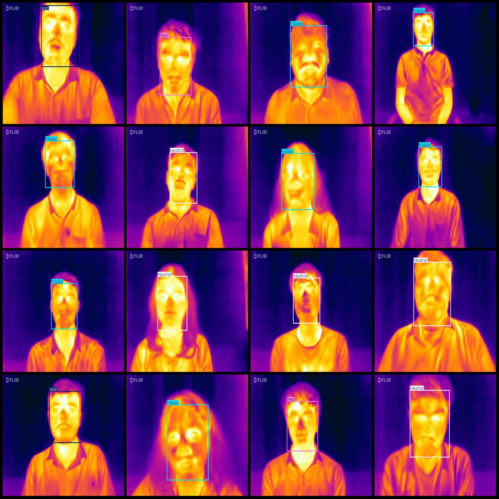

# Infrared Face Expressions Dataset (VOC+YOLO) - 338 Images with 7 Classes

The dataset is formatted as Pascal VOC and YOLO, without the split path in a txt file. It only contains jpg images along with their corresponding VOC-formatted xml files and YOLO-formatted txt files.

Number of Images: 338
Number of Annotations: 338
Number of Annotations: 338
Number of Annotation Categories: 7

Note that the order of categories in the YOLO-formatted txt file might be different from this list, but it aligns with the labels folder's "classes.txt".

Classification: ["angry", "disgust", "fear", "happy", "neutral", "sad", "surprise"]

Each category has the following number of bounding boxes:
- Angry : 23 bounding boxes, occupying 23 images
- Disgust : 29 bounding boxes, occupying 29 images
- Fear : 35 bounding boxes, occupying 35 images
- Happy : 67 bounding boxes, occupying 67 images
- Neutral : 98 bounding boxes, occupying 98 images
- Sad : 54 bounding boxes, occupying 54 images
- Surprise : 32 bounding boxes, occupying 32 images
Total number of bounding boxes: 338

Image resolution: 640x480

Annotation tool used: labelImg
Annotation rules: draw bounding boxes for each category

Important Note: The dataset does not have separate training, validation, or test sets; you will need to divide them yourself.

Special Remark: This dataset does not guarantee any accuracy improvement in models trained on it or the weights of the model.

Image Preview:
## Images

Here is a pay link on Stripe ( https://buy.stripe.com/3cs8yP7sY87d0vu9AB ). Please contact me lonlonago@foxmail.com after funding $89, and I will send you a complete data files , thank you!

